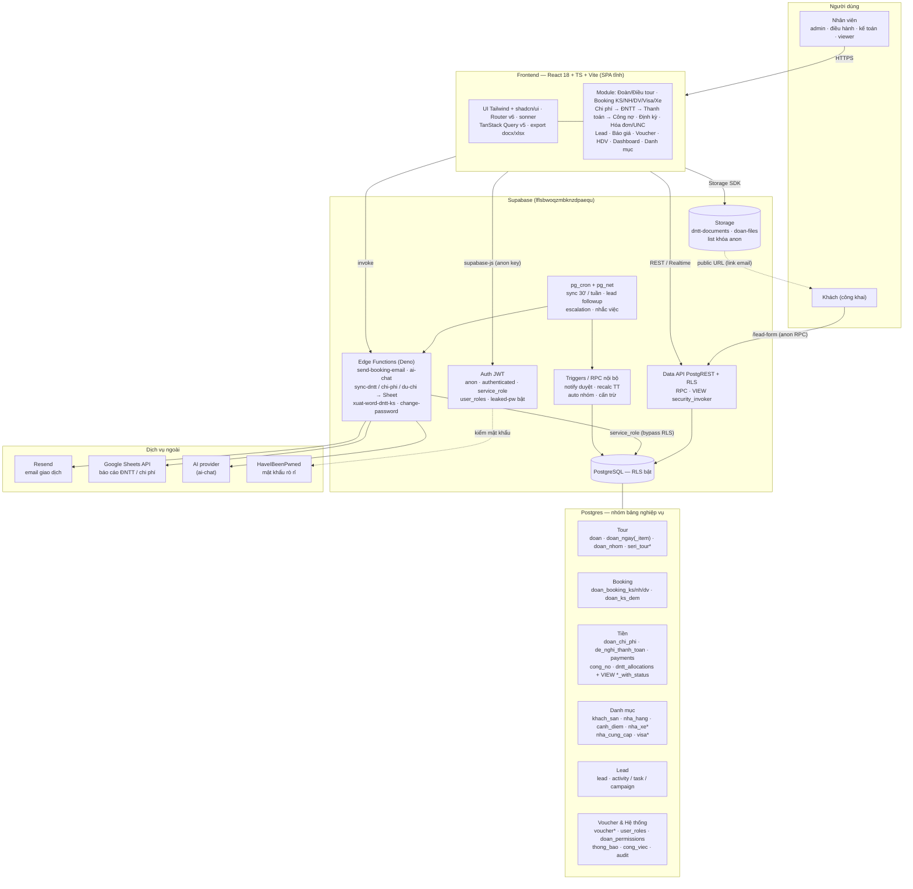
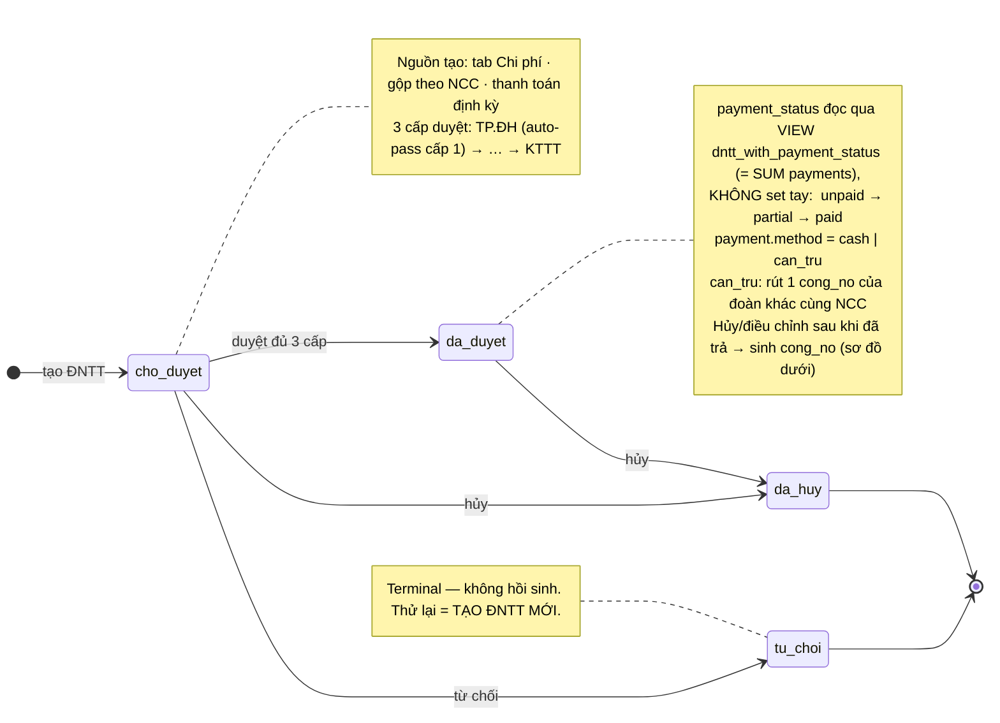
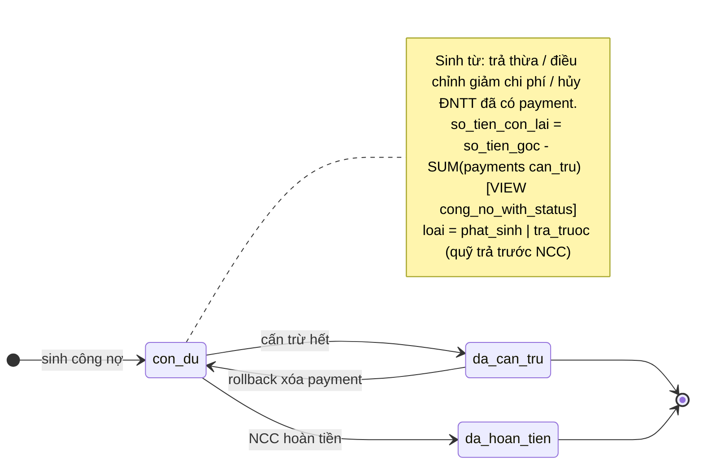

# 🏛️ ARCHITECTURE — S8 Travel CRM

> Tài liệu kiến trúc + **tri thức ngầm** của dự án. Mục tiêu: bất kỳ dev mới nào
> đọc xong hiểu được hệ thống chạy thế nào và **vì sao code lại viết như vậy** —
> gỡ rủi ro "kiến thức nằm trong đầu 1 người".
>
> - **Schema DB chi tiết** → xem `CLAUDE.md` (đã verify từ DB thực). Tài liệu này
>   KHÔNG lặp lại schema, chỉ giải thích quan hệ + bất biến.
> - Tài liệu sống: sửa khi đổi kiến trúc. Ngày tạo: 2026-05-19.

---

## 🗺️ Sơ đồ kiến trúc tổng thể

> Bird's-eye view: client → Supabase (Auth / Data API+RLS / Edge Functions /
> Storage / pg_cron) → Postgres + dịch vụ ngoài. Quan hệ bảng chi tiết xem §4.
> Cập nhật 2026-06-01 (sau đợt siết bảo mật theo Security Advisor: view
> `security_invoker`, khóa list bucket cho `anon`, bật leaked-password,
> revoke EXECUTE hàm nội bộ).



---

## 1. Hệ thống là gì

CRM nội bộ điều hành tour cho S8 Travel: quản lý **lead → báo giá → đoàn tour →
điều tour (lịch trình) → booking (KS/NH/DV/Xe/Visa) → chi phí → đề nghị thanh
toán → hóa đơn/UNC → công nợ**, kèm phân việc, dashboard, lock phòng theo seri.

Người dùng là **nghiệp vụ, không phải dev** → mọi tính năng cần kịch bản test thủ
công để họ tự verify. Tiền bạc là trọng tâm: sai số tiền/công nợ = hậu quả thật.

## 2. Tech stack & bố cục

- React 18 + TypeScript + Vite · Tailwind + shadcn/ui
- TanStack Query v5 (mọi server state) · React Router v6 · sonner (toast)
- Supabase (Postgres) — project `lflsbwoqzmbknzdpaequ`, client
  `@/lib/supabase-external` (`externalSupabase`)
- docx (xuất Word) · recharts (chart) · i18next + react-i18next (đang migrate)

Bố cục: `src/pages` (route), `src/components/<domain>`, `src/hooks/use-*.ts`
(query/mutation theo bảng/nghiệp vụ), `src/lib` (helper, export, i18n).
Chi tiết file → `CLAUDE.md`.

## 3. Tầng dữ liệu (Supabase)

- **Data API grants (từ 30/10/2026):** `CREATE TABLE` mới trong `public` KHÔNG
  còn auto-expose qua API → **bắt buộc kèm GRANT + RLS** trong migration (template
  ở `CLAUDE.md`). `ALTER TABLE` (thêm cột/index/trigger) **không cần** grant.
- **RLS:** hầu hết bảng dùng policy kiểu `auth.uid() IS NOT NULL` cho `ALL`
  (đăng nhập là thao tác được). Phân quyền thật nằm ở **tầng UI**
  (`use-permissions`, `user_roles.role/bo_phan`), KHÔNG ở RLS.
- **Generated columns:** `doan_chi_phi.thanh_tien`, `doan_ngay_item.thanh_tien`
  là GENERATED → **destructure bỏ trước khi insert/update**, không bao giờ ghi.
- **RPC quan trọng:** `recalc_chi_phi_payment_status` — nguồn DUY NHẤT tính
  `doan_chi_phi.trang_thai_thanh_toan` (dựa SUM(payments)), KHÔNG set tay.
- **Edge Functions:** `send-booking-email` (Resend, mọi mail booking/UNC),
  `xuat-word-booking-ks`, `xuat-word-dntt-ks`, `process-bao-gia` +
  `extract-chuong-trinh` (AI báo giá), `sync-dntt-to-sheet`, `ai-chat`,
  `extract-chuong-trinh`, `Change-password`. **Không có** cron lead automation
  (playbook chưa triển khai — xem §11).
- **Realtime publication — CẠM BẪY LỚN:** `postgres_changes` chỉ nhận event nếu
  bảng nằm trong publication `supabase_realtime`. DB này ban đầu KHÔNG add bảng
  nào → mọi `useRealtime*` cũ là **code chết**. Đã thêm: `thong_bao`,
  `doan_chi_phi`, `doan`, `doan_ngay`, `doan_ngay_item` (+ `REPLICA IDENTITY
  FULL`). Thêm realtime cho bảng mới = phải `ALTER PUBLICATION ... ADD TABLE`
  (DDL trên bảng có sẵn → không cần grant).

## 4. Mô hình dữ liệu cốt lõi (quan hệ)

```
lead ──(chốt)──> doan ──< doan_ngay ──< doan_ngay_item
 │                 │                         │
 └─ báo giá (kế hoạch)                       └── cascade ──> doan_chi_phi
                   ├──< doan_booking_ks/_nh/_dv (snapshot giá)
                   └──< doan_chi_phi ──< dntt_allocations >── de_nghi_thanh_toan
                                                                  │
                                              payments (cash|can_tru) ┘
                                                                  │
                                                            cong_no (dư/hoàn)
danh mục: khach_san · nha_hang(+set_menu) · canh_diem · nha_xe · nha_cung_cap
          · seri_tour(+_ngay/_item) · don_vi_visa
```

`doan.xe_id` → `nha_xe_loai_xe` (KHÔNG phải bảng `xe`). `doan.seri_id` →
`seri_tour` (template lịch trình, đổ vào `doan_ngay/_item` khi áp seri).

## 5. ⚠️ CÁC BẤT BIẾN NGHIỆP VỤ (đọc kỹ — đây là tri thức ngầm chính)

### 5.1 Snapshot bắt buộc — đổi danh mục KHÔNG được ảnh hưởng đoàn cũ
Mọi giá/hệ số tính tiền phải **đông cứng vào DB của tour ngay khi tạo**:
`doan_ngay_item.don_gia` (cảnh điểm, INSERT-only), `doan_booking_nh.gia_snapshot`
/`ten_set_snapshot`/`mon_an_snapshot`, `doan_booking_dv.dich_vu_list` (JSONB),
`doan_ks_dem.gia_phong` (user nhập), `doan_chi_phi.foc_khach_snapshot`/
`foc_mien_snapshot`/`chiet_khau_phan_tram_snapshot`. **Hiển thị/tính chi phí
KHÔNG được đọc trực tiếp `khach_san.foc_*`/`nha_hang.chiet_khau`/
`nha_hang_set_menu.gia`/`canh_diem.gia_mac_dinh`** cho dòng đã tạo — phải dùng
helper resolve (`resolveKSFoc`/`resolveNHFoc`/`resolveNHChietKhau`,
snapshot-first, chỉ fallback master khi snapshot NULL = legacy). Đây là nỗi sợ
số 1 của nghiệp vụ: "đoàn đã đi xong, ai sửa danh mục → loạn chi phí".

### 5.2 HYBRID cascade Điều tour ↔ Chi phí
`doan_chi_phi.so_luong`/`don_gia` (cảnh điểm + NH + bảo hiểm) là field
**bidirectional** với cờ `is_overridden`:
- default (`false`): cascade từ Điều tour mỗi lần lưu (rebooking đổi số khách →
  `useUpdateDoan` cascade tự động, reset `thanh_tien_thuc_te=NULL`, recalc).
- OP sửa tay ở tab Chi phí → `is_overridden=true` → cascade BỎ QUA dòng đó.
- nút ↺ reset → `is_overridden=false`.
- Cascade SKIP extras (`[dvps_]`/`[trua]`/`[toi]`) và dòng `paid/partial_paid`.
- KS **KHÔNG cascade** — độc lập (xem §7 sticky pattern).

### 5.3 ĐNTT — 3 thực thể tách biệt (refactor 2026-05)
- `de_nghi_thanh_toan` = chỉ là REQUEST. Lifecycle DUYỆT:
  `cho_duyet → da_duyet → tu_choi/da_huy`.
- `payments` = mỗi sự kiện trả tiền (`cash` | `can_tru`). `can_tru` rút 1
  `cong_no` (của đoàn KHÁC) → cong_no_id NOT NULL.
- `cong_no` = nợ từ trả thừa/hủy-sau-khi-trả. `con_du → da_can_tru|da_hoan_tien`.
- **payment_status / paid_amount / thanh_toan_luc đọc qua VIEW
  `dntt_with_payment_status`** (= SUM(payments)), KHÔNG có cột này trên
  `de_nghi_thanh_toan` (đã DROP). Trạng thái duyệt ≠ trạng thái trả tiền.
- Điều chỉnh sau thanh toán: tính `delta` từ `chi_phi.so_tien_da_dntt`
  (commitment thật, computed bởi RPC) — KHÔNG từ `dnttGoc.so_tien` (frozen) hay
  `chi_phi.thanh_tien` (user edit được). `thanh_tien_thuc_te` set ABSOLUTE qua
  `proRataInts`, KHÔNG cộng dồn delta.

#### 5.3.1 Sơ đồ trạng thái — ĐNTT & công nợ

**ĐNTT** (`de_nghi_thanh_toan`): trục DUYỆT (`trang_thai_duyet`) tách rời trục TRẢ
TIỀN (`payment_status` derived). Hủy có thể xảy ra cả khi đã trả 1 phần.



**Công nợ** (`cong_no`): sinh từ trả thừa / điều chỉnh giảm / hủy ĐNTT đã có
payment; tiêu bằng cấn trừ (`payment.method=can_tru`) hoặc NCC hoàn tiền mặt.



### 5.4 FOC (free of charge)
- **KS theo phòng × ĐÊM, KHÔNG nhân `so_dem`** (mỗi LocalKSRow = 1 đêm). Công
  thức display (`calcFocDeduction`) và lưu DB (`handleBlurSave`) PHẢI giống hệt.
- **NH theo khách:** `so_mien = floor(so_khach/foc_khach)*foc_mien`,
  `thanh_tien = (so_khach - so_mien) * don_gia`.
- Người trả: `cong_ty` → `tien_cong_ty=thanh_tien, tien_hdv=0`; `hdv` → ngược
  lại. HDV trả cash trên đường → **loại khỏi flow ĐNTT** (chỉ quyết toán gộp).

### 5.5 Khác
- 1 NH/DV chỉ xuất hiện tối đa 1 dòng/tour.
- Tiền hiển thị: `n.toLocaleString("vi-VN")`.
- Không `<form>` — dùng onClick/onBlur (auto-save).

## 6. State & data-fetch (FE)

- **TanStack Query** là nguồn server-state. Query key theo bảng/đoàn (danh sách
  đầy đủ ở `CLAUDE.md` §Query Keys). Mặc định (App.tsx): `staleTime 30s`,
  `gcTime 5m`, **`refetchOnWindowFocus: false`**, `retry 1` → không tự refetch
  khi quay lại tab; chỉ refetch khi mount/invalidate/realtime.
- **Auto-save blur:** `<Input onBlur={() => mut.mutate(...)}>`. Pattern
  local-state + `ref` mirror để callback (setTimeout từ onBlur) đọc value mới
  nhất, tránh stale closure.

## 7. ⚠️ Các pattern UI dễ sai (đã trả giá bằng bug)

### 7.1 Chi phí KS/NH "sticky" localRows + sessionStorage
`ChiPhiKSSection`/`ChiPhiNHSection` ôm `localRows` (KS còn lưu sessionStorage)
làm buffer sửa inline. Hệ quả: **dòng đã lưu trước đây hiển thị từ local, không
tự đồng bộ DB** → cross-tab/cross-máy thấy số cũ. Đã fix bằng:
- **Reconcile**: dựng lại dòng đã lưu từ `chiPhiRows` (= `doan_chi_phi`, snapshot
  tour), overlay dòng dirty + dòng chưa có `id`. localRows thu hẹp về đúng vai
  "buffer dirty + dòng chưa lưu".
- **Row-input external-sync**: component ô nhập (`KSRowInput`/`KSServiceRowInput`,
  `HDVHoTroRow`) dùng `useState(prop)` seed 1 lần → KHÔNG re-sync khi prop đổi
  do reconcile → phải thêm `externalKey` + `lastSyncedKeyRef` re-sync, không đè
  lúc đang gõ. **Bất kỳ memo-row nào `useState(prop)` đều có lỗi này.**
- DV/Xe/Visa dùng pattern **self-correcting** `getRowEdit = editRow[id] ?? rowTừDB`
  (xóa editRow khi save) → an toàn sẵn, chỉ cần realtime invalidate.
- Bẫy `||`: `cp.so_luong || 1` biến giá trị **0** hợp lệ thành 1 → dùng `??`.

### 7.2 Điều tour — dirty-guard sạch hơn (làm chuẩn)
`DoanDetail` giữ `days` (in-memory, KHÔNG sessionStorage). Effect merge từ DB chỉ
ghi đè khi `!hasPendingChangesRef.current` → không reset người đang gõ, vẫn tươi
khi không nhập dở. Đây là pattern **nên nhân rộng** (gọn hơn sticky KS/NH).

### 7.3 Auto-save Điều tour debounce 1.5s — VÌ SAO không lưu ngay
Chi phí lưu/ô (1 dòng `doan_chi_phi` = 1 upsert rẻ). Điều tour 1 lần lưu =
`useSaveDieuTour` diff toàn `doan_ngay`+`doan_ngay_item` + **cascade `doan_chi_phi`**
(snapshot, pre-check DNTT, recalc) — hàng chục round-trip tuần tự. Lưu mỗi
keystroke = đắt + cascade trên dữ liệu dở. Debounce 1.5s **bảo vệ server +
đúng đắn**; "đang lưu lâu" là do mutation nặng, KHÔNG do debounce. Trạng thái:
`Chờ lưu…` (debounce) → `Đang lưu...` (mutation) → `✓ Đã lưu` (800ms).

### 7.4 Realtime cross-client
Pattern đúng (bảng mới): `useEffect` + `externalSupabase.channel().on(
'postgres_changes',{event,schema:'public',table,filter:'col=eq.<id>'},cb)
.subscribe()` + cleanup `removeChannel`. **KHÔNG** dùng pattern cũ `useQuery`
trả channel (leak, không cleanup). Tránh double-count khi gửi mail UNC có cấn
trừ: mail phải tách Tổng / Cấn trừ / Thực chuyển khoản.

## 8. i18n (đang migrate — xem memory `project-i18n-zh-migration`)

- Cũ: Google Translate (cookie `googtrans=/vi/zh-TW`) dịch cả trang + 2 lớp
  override/correction.
- Mới: **react-i18next**, key = **chuỗi tiếng Việt gốc** (natural key), bản dịch
  `src/locales/zh-TW.json`. `@/lib/i18n` giữ API `t()`/`useTranslate()` cũ
  (chỉ thay ruột). **GT giữ làm fallback TẠM** trong lúc di trú; chuỗi đã `t()`
  + có trong json dùng bản chuẩn (gắn `notranslate` để GT không đè).
- Migrate dần theo module (đã xong: hạ tầng + Sidebar; đang: Dashboard/Danh sách
  đoàn). `ZH_CORRECTIONS` = sửa nhanh bản GT sai khi chưa kịp wrap.

## 9. Bản đồ module

| Module | Vào ở | Hook chính | Ghi chú kiến trúc |
|---|---|---|---|
| Lead + Next-Action | `/leads`,`/viec-lead` | use-leads, use-lead-next-action, lib/lead-next-action | Engine thuần `computeNextAction`; cadence trong `lead_cadence`. Phase A done. Playbook auto-send = CHƯA làm (thay bằng Next-Action). |
| Đoàn / Điều tour | `/doan`,`/doan/:id` | use-doan, use-dieu-tour | Cascade HYBRID; debounce save; realtime `useDoanDetailRealtime`. |
| Booking KS/NH/DV | tab trong DoanDetail | use-booking-ks/nh/dv | Snapshot giá vào booking; email qua `send-booking-email` (giữ thread). |
| Chi phí | tab Chi phí | use-chi-phi(+ks/nh/hdv) | Sticky KS/NH (§7.1); HYBRID; FOC. |
| ĐNTT/Hóa đơn-UNC/Công nợ | `/de-nghi-thanh-toan`,`/hoa-don-unc`,`/cong-no` | use-dntt, use-hoa-don-unc, use-cong-no, use-payments | 3 thực thể §5.3; mail UNC `UncEmailModal` (resolve email: booking→danh mục NH/KS→nha_cung_cap). |
| Báo giá | `/bao-gia` | use-bao-gia | ĐANG revamp (memory `project-bao-gia-revamp`): catalog-driven + gắn lead + ghép/riêng + hợp đồng. Chưa code. |
| Lock Phòng | `/lock-phong` | use-lock-phong | Summary loại đã hủy/thành đoàn; cửa sổ deadline 3/7 ngày. |
| Dashboard | `/dashboard` | use-dashboard | Chỉ đọc, role ≥ truong_phong. |
| Phân việc / MyJob | `/my-job` | use-cong-viec, use-phan-viec | `cong_viec`+`thong_bao`; trigger DB `trg_doan_phanviec_events` (hủy/đổi số khách → báo người phụ trách pv_*). |
| Danh mục | `/quan-ly/*` | use-khach-san/nha-hang/... | Đổi danh mục KHÔNG ảnh hưởng đoàn cũ (§5.1). |

## 10. Quy ước & cạm bẫy (checklist khi code)

- KHÔNG insert generated column (`thanh_tien`).
- KHÔNG set `trang_thai_thanh_toan` tay → dùng RPC recalc.
- KHÔNG đọc danh mục cho dòng chi phí đã tạo → dùng resolve helper/snapshot.
- KHÔNG xóa ĐNTT đã `da_duyet`/đã có payment → dùng `useCancelDNTT`.
- Realtime bảng mới → nhớ `ALTER PUBLICATION supabase_realtime ADD TABLE`.
- Memo-row `useState(prop)` → phải có external-sync (§7.1).
- `||` với số có thể = 0 → dùng `??`.
- Migration `CREATE TABLE` → kèm GRANT + RLS.
- Verify trước push: `npx tsc --noEmit -p tsconfig.json` + `npx vite build`.
- Push chỉ khi user yêu cầu; KHÔNG commit `.claude/settings.json`, file lạ.

## 11. Nợ kỹ thuật / hướng mở rộng

- **Báo giá revamp** (đã chốt thiết kế, chưa code) — memory.
- **i18n** còn nhiều module chưa wrap (GT lo tạm) — memory.
- **Lead Playbook** (`LEAD_PLAYBOOK.md`) = CHƯA triển khai, đã bị thay bằng
  Next-Action; chỉ thiếu khâu auto-gửi email/Zalo (Phase B, cần Resend/ZNS).
- **Chi phí KS/NH** vẫn sticky-sessionStorage — ứng viên refactor sang dirty-
  guard kiểu Điều tour (vùng nhạy cảm FOC/snapshot, làm cẩn thận).
- Concurrent edit = last-write-wins (chưa có optimistic-lock).

## 12. Tài liệu liên quan

- `CLAUDE.md` — schema DB verify + file structure + rules (source of truth).
- `LEAD_NEXT_ACTION.md` / `_PHASE_A.md` — spec Lead Next-Action.
- `LEAD_PLAYBOOK.md` — spec follow-up automation (CHƯA làm, đã bị thay).
- `LEAD_TODO.md` / `SESSION_NOTES.md` — trạng thái/việc Lead.
- Memory dự án (Claude): payment flow, realtime publication, báo giá revamp,
  i18n migration, HDV invoice push.
