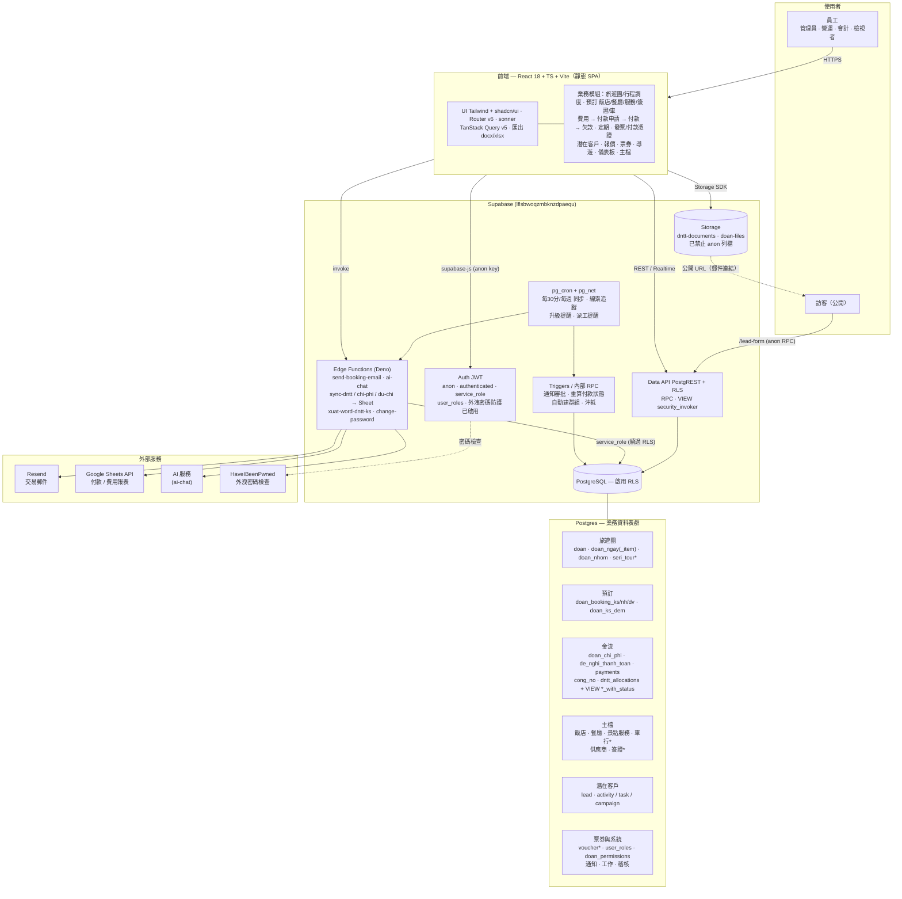
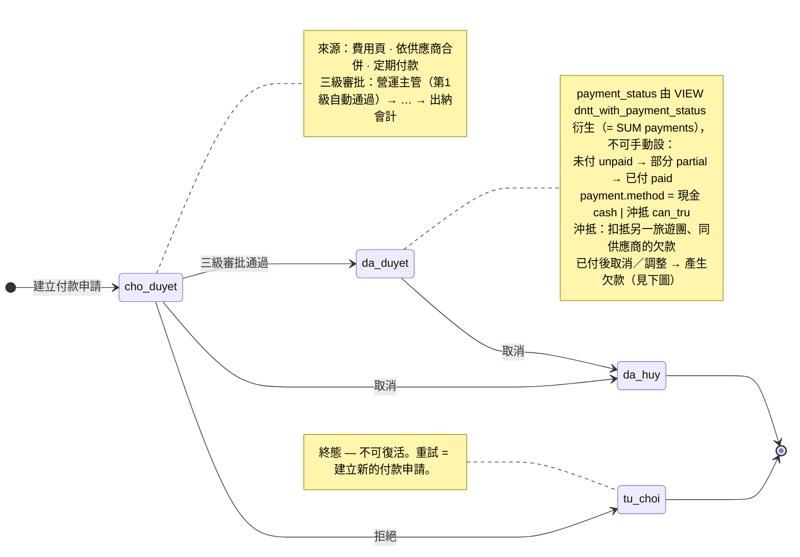
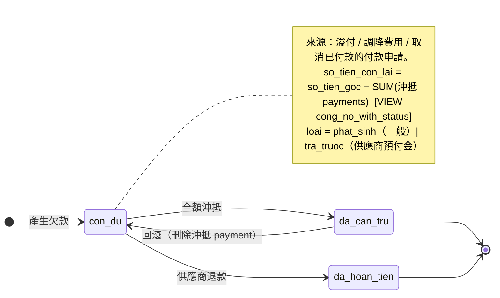

# 🏛️ 系統架構圖 — S8 Travel CRM（繁體中文）

> 本檔聚焦**架構圖**（繁中）。完整架構說明與隱性知識請以越南文 `ARCHITECTURE.md`
> 為準；資料表 schema 細節見 `CLAUDE.md`。狀態圖中的狀態節點刻意保留資料庫 enum
> 原值（如 `cho_duyet`/`da_duyet`），標籤與註解則以繁中說明。更新日：2026-06-01。

---

## 1. 系統概述

S8 Travel 內部旅遊團營運 CRM，主流程：
**潛在客戶 → 報價 → 旅遊團 → 行程調度 → 預訂（飯店／餐廳／服務／簽證／車）
→ 費用 → 付款申請 → 發票／付款憑證 → 欠款／沖抵**，另含派工、儀表板、依範本鎖房。

- 使用者為**業務人員（非工程師）** → 每項功能都需可手動驗證。
- **金額是核心**：算錯費用／欠款 = 真實損失。
- 技術棧：React 18 + TypeScript + Vite · Tailwind + shadcn/ui · TanStack Query v5
  · React Router v6 · Supabase（PostgreSQL，專案 `lflsbwoqzmbknzdpaequ`）。

## 2. 整體架構圖

## 3. 金流核心（三個獨立實體）

付款流程刻意拆成三個實體（2026-05 重構）：

- **`de_nghi_thanh_toan`（付款申請）** — 只是「請求」。**審批軸**
  (`trang_thai_duyet`) 與**付款軸** (`payment_status`，由 VIEW 衍生) 互相獨立。
- **`payments`** — 每筆付款事件，`method = cash`（現金）或 `can_tru`（沖抵）。
  沖抵會扣抵另一張 `cong_no`（同供應商、另一旅遊團）。
- **`cong_no`（欠款／餘額）** — 來自溢付、調降費用、或「已付款後取消」。
  `payment_status` / `paid_amount` 一律透過 VIEW `dntt_with_payment_status`
  讀取（= `SUM(payments)`），**不可手動設定**。

### 3.1 付款申請狀態圖

### 3.2 欠款狀態圖

## 4. 關鍵不變量（簡述）

- **快照（snapshot）**：所有影響費用的單價／係數，建立旅遊團當下即「凍結」寫入團的
  資料（`doan_ngay_item.don_gia`、`doan_booking_nh.gia_snapshot`、
  `doan_chi_phi.foc_*_snapshot` 等）。**主檔日後變動不可影響已建立的舊團**。
- **行程調度 ↔ 費用 HYBRID 連動**：`doan_chi_phi` 預設隨行程調度級聯；OP 手動改後設
  `is_overridden=true` 即不再被覆寫。
- **飯店 FOC（Option A）**：`foc_count` 由 OP 手動填於各列，
  `tien_cong_ty = (so_luong − foc_count) × gia_phong`，不再自動分攤。
- **權限**：目前主要在 UI 層（`user_roles.role/bo_phan`）；金流 VIEW 已改
  `security_invoker`，為日後逐列 RLS 收緊（#5）做準備。

---

> 詳細規則、UI 陷阱、模組對照表請見越南文 `ARCHITECTURE.md`（唯一真實來源）。
